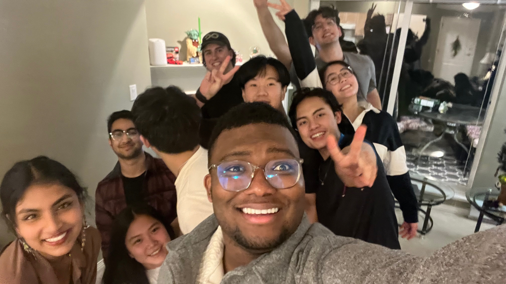
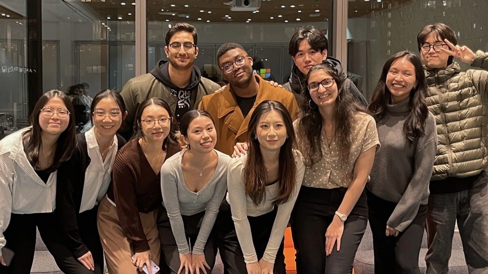
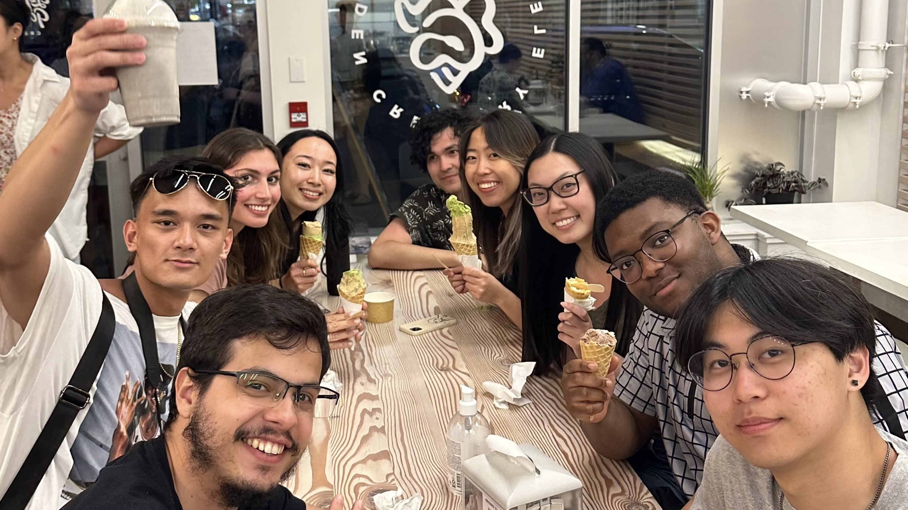

<Tip>
  Grown Family
</Tip>

  > Part of our cohort of 75 BUCS friends from freshman year. Grow together in personal, academic and professional ways and champion our successes along the way.

<Tip>
  Chosen Family
</Tip>

    Mission Statement: Empowering students from diverse backgrounds to believe they too, can become Product Managers. We do this by being leaders and recognizing that great leaders are: 
    - Empathetic, Transparent, Accountable, Fail fast, and take things one step at a time

<Tip>
  Found Family
</Tip>

    > Microsoft Vancouver Interns - came together from different universities eager to embark on a new journey 
