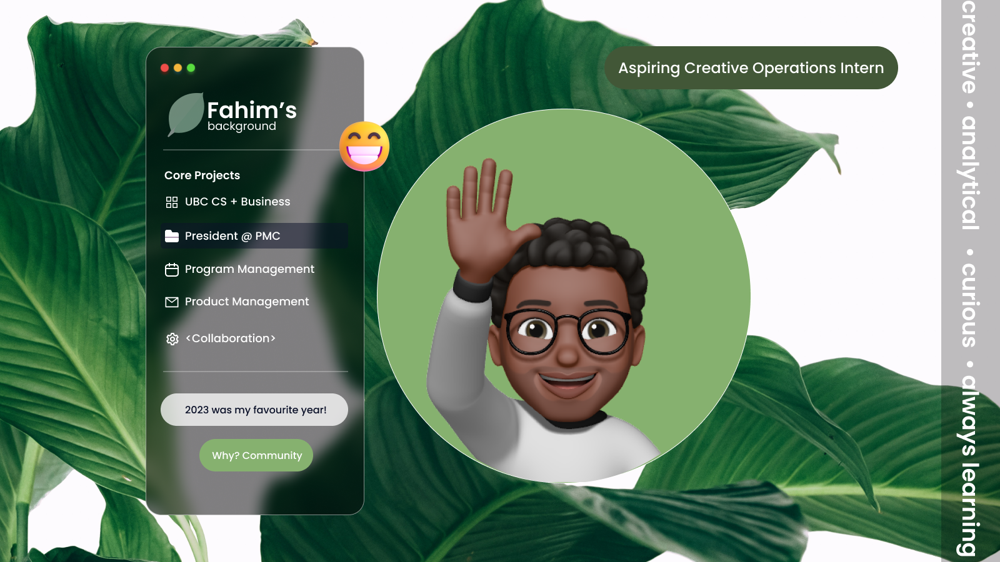

<br />

```bash bson
{
  "skills": {
    "programming": ["Java", "SQL", "Python", "C/C++", "VBA", "HTML/CSS"],
    "data": ["categorizing", "processing", "cleansing", "visualization"],
    "pm": ["product sense", "roadmapping", "testing", "project management"],
    "creative": ["graphic design", "prototyping", "branding", "writing"]
  },
  "tools": ["Jira", "Confluence", "Figma", "Tableau", "Excel"],
}

```
